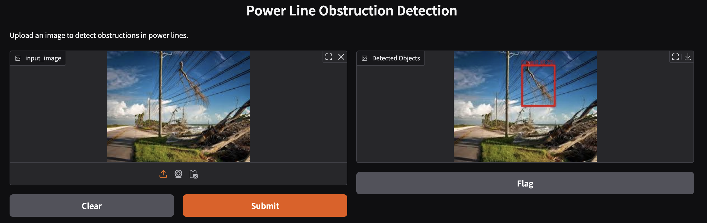

# Computer Vision-Based Obstruction Detection

## Overview
This project leverages advanced computer vision models to automatically detect and classify obstructions near SDG&E power lines. By analyzing visual/aerial data, the system aims to identify potential hazards like vegetation encroachment and damaged equipment before they can cause infrastructure damage or trigger wildfires. This proactive approach enhances grid reliability and public safety through early detection of risks.

**Video of working model demonstration**

## Introduction
California has been facing surges in wildfires, often sparked by electrical infrastructure during high winds and equipment failures. Currently, SDG&E uses Public Safety Power Shutoffs (PSPS), cutting power during dangerous conditions, to reduce the spread of these fires. While effective, PSPS also causes economic losses and health risks. As wildfire threats grow, data-driven strategies to mitigate these risks proactively are essential to maintain the safety and well-being of San Diegans.

## Methodology
Our methodology for developing an obstruction detection system for electrical assets using YOLOv11 followed a structured pipeline combining computer vision best practices with modern deep learning techniques. YOLOv11, released in late 2024 by Ultralytics, represents the latest advancement in the YOLO (You Only Look Once) family of object detection models. We chose YOLOv11 for our project due to its superior performance in real-time object detection scenarios. YOLOv11 achieves higher mean Average Precision (mAP) and is more computationally efficient than its predecessors, allowing for quicker and more accurate identification.

**figure here**

  
🔍 <strong>Exploratory Data Analysis (EDA)</strong>

  
We began by conducting EDA on outage data and infraction data per equipment type...

  
📊 <strong>Dataset Curation</strong>

  
We gathered relevant videos and images, then used Roboflow for image annotation...

  
🖼 <strong>Image Annotation & Augmentation</strong>

  
We labeled images with bounding boxes for obstructions and used augmentation techniques...

The implementation of our models' consisted of five primary phases: EDA(exploratory data analysis), dataset curation, model configuration, training optimization, and performance evaluation. Through conducting EDA on outage and infraction data per equipment type we were able to see that poles, conductors, and crossarms were the electrical assets that had the highest number of outages and infractions. In the second phase, we curated data for our model by gathering relevant videos and images then manually annotated each image labeling the poles, wires, and obstructions. The dataset consists of 383 annotated images with nearly an equal split between obstruction and non-obstruction images. In the third phase, we enhanced the dataset by applying image augmentations (such as auto-orient, resize, contrast adjustment, horizontal/vertical flips, rotations, shears, changes in hue, brightness, exposure, blur, and noise). These augmentations aided in improving the model's robustness. To train our model, we took three different approaches. One trained on all three classes (poles, wires, and obstructions), one only on obstructions, and one on three different models (one for each respective class) and combined then refined through Non-maximum suppression.

    Notes:
   Train model with augmentation

## Results

**Model Performance Comparison table**

**Obstruction-Only Model**
The obstruction-only model performed quite well by focusing exclusively on detecting obstructions, this model demonstrated superior performance in identifying potential hazards. This model observed an mAP50 of .77.

**Multi-Class Model (Poles, Wires, Obstructions)**
Our multi-class model, trained to simultaneously detect poles, wires, and obstructions, showed lower performance compared to the obstruction-only model, which struggled with the complexity of distinguishing between multiple classes. This model observed an mAP50 of .521.

**Independent Models for Each Class**
Our approach using separate models for poles, wires, and obstructions, followed by NMS, yielded **the best results**. This model observed an mAP50 of .77. This method performed the best in detecting obstructions as it has the same metrics as the obstruction-only model but also performed the best visually, removing double bounding boxes and labeling poles and wires as well.

## Conclusion
We found that utilizing independent models with non-max suppression yielded the best results. Our findings underscore the importance of tailoring the modeling approach to the specific needs of the task at hand. In the context of electrical asset management, the ability to reliably detect obstructions proved more valuable than a more comprehensive but potentially less accurate multi-class detection system. The use of such Computer vision models may prove helpful in proactively preventing wildfires and working to improve the safety and well-being of residents.

## Data Sources
- SDG&E Infraction Reports (2020-2024)
- Equipment maintenance records
- Risk assessment documentation
- Google images
